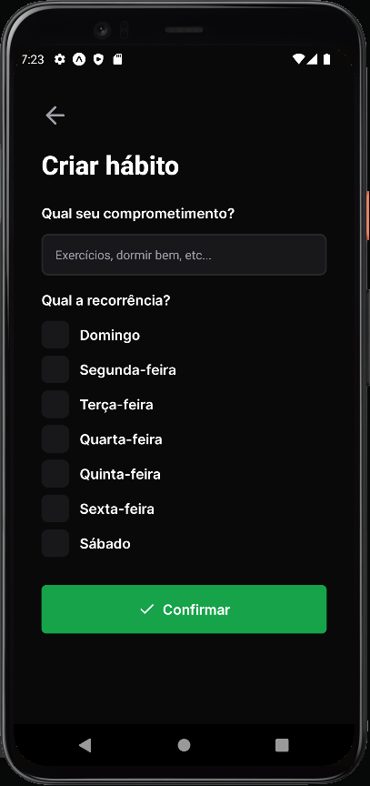
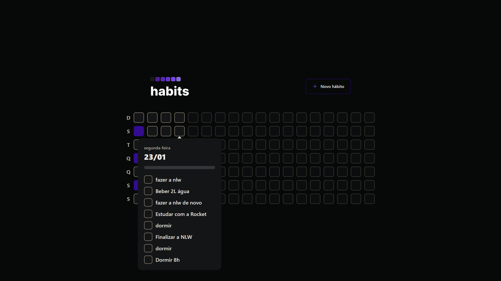

<h1 align="center"> Evento Nlw Setup </h1>

  <a href="#-tecnologias">Tecnologias</a>&nbsp;&nbsp;&nbsp;|&nbsp;&nbsp;&nbsp;
  <a href="#-projeto">Projeto</a>&nbsp;&nbsp;&nbsp;|&nbsp;&nbsp;&nbsp;
  <a href="#-como-iniciar-o-projeto">Como iniciar</a>&nbsp;&nbsp;&nbsp;|&nbsp;&nbsp;&nbsp;
  <a href="#memo-licença">Licença</a>&nbsp;&nbsp;&nbsp;|&nbsp;&nbsp;&nbsp;
  <a href="#-developed-by-bruno-catan-">Contato</a>&nbsp;&nbsp;&nbsp;

  

 

<h3> - Designer Mobile </h3> 

    
    
    
    

##

<h3> - Designer Web</h3> 

    
    
    

 

## 🚀 Tecnologias

Esse projeto foi desenvolvido com as seguintes tecnologias:

- React;
- vite;
- React Native;
- Expo;
- Node.js;
- TypeScript;
- Tailwind CSS;
- Express;
- Prisma;
- Radix UI;
- SQlite;
- Axios;

## 💻 Projeto

Aplicação de criação de hábitos, listagem de hábitos, marcação de concluído, percentagens e etc...

## 💻 Como iniciar o projeto

### Iniciando o Servidor

1. Execute `npm install` para instalar todas as dependências
2. Execute `npx prisma migration` para criar o banco de dados
3. Execute `npm run dev` inicialize server

### Iniciando o web

2. Execute `npm install` para instalar todas as dependências
3. Execute `npm run dev` para iniciar o projeto

### Iniciando o mobile

1. Execute `npm install` para instalar todas as dependências
2. Execute `npx expo start` para iniciar o projeto
3. Digitalize o QRcode no navegador com o aplicativo expo no 'Android OS' ou aplicativo de câmera no 'IOS'

## :memo: Licença

Esse projeto está sob a licença MIT.

---

  <h3> Developed by <a href="https://www.linkedin.com/in/brunocatan/">Bruno Catan</a> ☕</h3>
  
  
  

